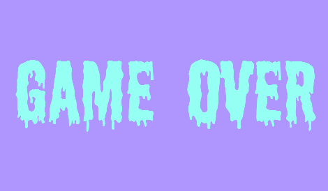

🎮

# Bomberman Game (Pomberman Clone)

This project is a Bomberman-like game (Pomberman clone) built entirely with pure JavaScript using Object-Oriented Programming (OOP) principles. It's a fun, browser-based game that allows you to move your character, plant bombs, defeat enemies, and advance through levels, all rendered with HTML and CSS (without using <canvas>).

🚀

# Features

Dynamic Grid System: Randomly generated destructible walls and a unique cell for level progression.
Player Movement: Control the player with arrow keys.
Bomb Mechanics: Place bombs, destroy walls, and defeat enemies with explosive power!
Enemy AI: Enemies move randomly, creating challenging obstacles for the player.
Power-ups: Extra bombs, extra lives, and other power-ups are hidden inside destructible walls.
Multiple Levels: Play through increasing difficulty levels as you reach unique cells to progress.
Scoring System: Earn points by destroying destructible walls and advancing through levels.
Game Over and Win Conditions: See dynamic end screens for both winning and losing.

🕹️

# How to Play

Movement: Use the arrow keys to navigate through the grid.
Bomb Placement: Press the spacebar to plant a bomb. Avoid the explosion radius!
Power-ups: Look for power-ups like extra bombs and extra lives hidden in destructible walls.
Win: Find the unique cell in each level to progress to the next one.
Enemies: Avoid enemies that move randomly or defeat them using bombs.

📊

# Game Stats

Player Lives: The player starts with 3 lives. You lose a life if hit by an explosion or enemy.
Bombs: You can place up to 3 bombs at the start, and more as you collect power-ups.

# Power-ups:

🎁 Extra Bombs: Increases your bomb count by 1.
❤️ Extra Lives: Adds an additional life to your player.
⏳ Extra Time: Increases the remaining time to complete the level.

# Levels:

There are 3 levels in total, each increasing in difficulty with more destructible walls and enemies.
🏆

# Screenshots

# Level Up Screen

# Game Over Screen

🛠️

# Installation & Setup

Clone this repository:

bash
Copy code
git clone https://github.com/yourusername/pomberman-clone.git
Open index.html in your browser to start playing the game!

🎨

# Assets

Images: Player, enemy, bomb, explosion animations, and power-ups are located in the ./images folder.
Sounds: Game sound effects (explosion, game over, etc.) are located in the ./sound folder.
🎧

# Game Sound Effects

Explosion: A dynamic explosion sound plays when bombs detonate.
Game Over: A game-over sound plays when the player loses all lives.
Make sure your browser is unmuted to enjoy the full experience!
